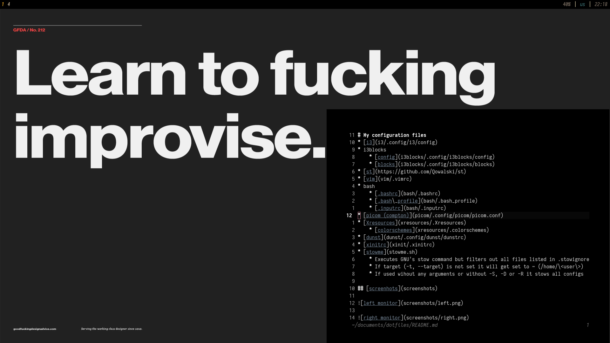

# My configuration files
* [i3](i3/.config/i3/config)
* i3blocks
    * [config](i3blocks/.config/i3blocks/config)
    * [blocks](i3blocks/.config/i3blocks/blocks)
* [st](https://github.com/Qowalski/st)
* [vim](vim/.vimrc)
* bash
    * [.bashrc](bash/.bashrc)
    * [.bash\_profile](bash/.bash_profile)
    * [.inputrc](bash/.inputrc)
* [picom (compton)](picom/.config/picom/picom.conf)
* [Xresources](xresources/.Xresources)
    * [colorschemes](xresources/.colorschemes)
* [dunst](dunst/.config/dunst/dunstrc)
* [xinitrc](xinit/.xinitrc)
* [stowme](stowme.sh)
    * Executes GNU's stow command but filters out all files listed in .stowignore
    * If target (-t, --target) is not set it will get set to ~ (/home/\<user\>)
    * If used wihout any arguments or without -S, -D or -R it stows all configs

## [screenhots](screenshots)

